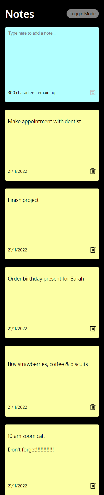

# React Notes App 

A notes app to practice React concepts such as Hooks including useContext, useState and useEffect. The user can add new notes to local storage and delete notes from LS. The user can choose light or dark mode.

[Deployed URL](https://nsharma-uk.github.io/react-notes-app/)

## Table of content

- [Technologies](#technologies)
- [User Story](#user-story)
- [Screenshots of the application](#screenshots-of-the-application)
- [Highlights and Next Steps](#highlights-and-next-steps)
- [Contact me](#contact-me)

## Technologies

- React
- CSS
- GitHub Pages

##User Story

```
AS A busy user
I WANT to be able to write and save notes
SO THAT I can organise my thoughts and keep track of things I need to do
```

```
GIVEN a note-taking application
WHEN I open React Notes App
THEN I am presented with a landing page of a single note with a text field and a disabled save button
WHEN I click on the text field
THEN I enter text
WHEN I a enter text into the field
THEN a Save icon becomes enabled
WHEN I click on the Save icon
THEN the note is saved and appears on the page
WHEN I want to delete a saved note
THEN I can click on the delete button
```

## Screenshots

<details>
<summary>Landing Page inc dark mode</summary>


</details>

<details>
<summary>Notes added</summary>


</details>

<details>
<summary>Mobile view</summary>




</details>

##Highlights and Next Steps

- This project was useful in providing more experience and familiarity of React Hooks, in particular useContext. The next React project will focus on the useReducer Hook.

- This time I used CSS to add a global style to the app. In the next React project I am going to focus on theme styles, using a ThemeProvider to bring in styles to the components.

## Contact me

If you have any questions about the portfolio, please do get in touch by contacting me via [email](mailto:nsharmauk711@gmail.com) or at [LinkedIn](https://www.linkedin.com/in/nsharma-uk).
